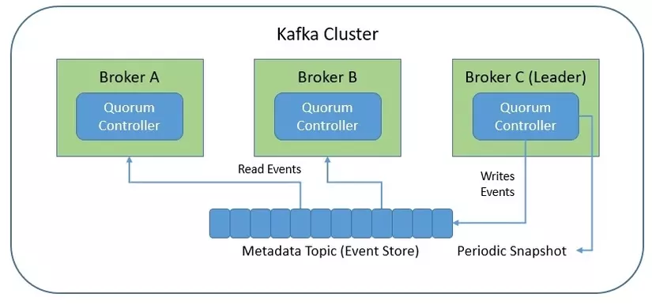

# How to build infrastructure
```sh
docker network create --driver bridge bigdata
sudo chmod +x *.sh
./start.sh

# stop all service
./stop.sh
```
# Port
1. web airflow: 8080, flower: 5555
2. Kafka
- Project; https://github.com/provectus/kafka-ui?tab=readme-ov-file
- Xem các ví dụ: https://github.com/provectus/kafka-ui/blob/master/documentation/compose/kafka-ui.yaml
- Các tham số: https://docs.kafka-ui.provectus.io/configuration/misc-configuration-properties
- Ví dụ: https://docs.kafka-ui.provectus.io/configuration/complex-configuration-examples/kraft-mode-+-multiple-brokers
ui: 9021
kafka internal: 19094-19096, external: 9091-9093
schema-registry: 8081
kafka-connect1: 8083-8084
prothemeus: 9090
grafana: 3000
kafka-ui:9021'

## Supper Set
1. Giao diện: 8088 (tốt nhất không động)
2. Có 1 service tên redis và db khá dễ conflic, superset còn liên quan đến source code nên hãy chỉnh các service khác tránh 2 cái tên này(cả port).

# Supper set
Nguồn cài đặt: https://superset.apache.org/docs/installation/docker-compose.
Khi pull project supper set về sẽ có 3 loại file docker-compose ở / của mã nguồn.
Supper Set không hỗ trợ cài đặt trên môi trường production với docker-compose vì docker không phải HA => Hỗ trợ k8s, nên thử với minikube.

Username và Password mặc định là admin.
1. docker-compose.yml: nó sẽ mount thư mục frontend/backend files vào các container. 1 khi script trong các file này thay đổi thì ta có thể nhìn thấy thay đổi ngay lập tức.

    nginx (80-80): reverse proxy để chuyển tiếp http request tới supper set.
    redis (6379-6379): cache hỗ trợ các tác vụ nền của supper-set có vai trò là message broker của celery.
    db (5432-5432): Đây là container PostgreSQL, được sử dụng như cơ sở dữ liệu backend cho Superset. Tất cả các metadata của Superset (như dashboard, biểu đồ, người dùng, quyền) sẽ được lưu trữ ở đây. Dữ liệu của PostgreSQL được lưu trong volume db_home.
    superset: Đây là service chính chạy Superset backend (ứng dụng web). Nó thực hiện tất cả các xử lý liên quan đến backend của ứng dụng Superset.
    superset-websocket (8080:8080): Cung cấp websocket server để xử lý giao tiếp thời gian thực giữa frontend và backend của Superset.
    superset-init: dùng để khởi tạo hệ thống
    superset-node: Chạy môi trường Node.js để xây dựng frontend cho Superset (biên dịch mã JavaScript/React).
    superset-worker: Là celery worker của supper set.
    superset-worker-beat: Chạy Celery Beat để lập lịch các tác vụ định kỳ (scheduled tasks) cho Superset.
    superset-tests-worker: Cung cấp một worker riêng biệt để chạy các test cho Superset trong môi trường phát triển. Service này giúp kiểm tra sự ổn định và tính chính xác của hệ thống khi chạy các tác vụ nền.

Phải clone cả source code của supper set về vì các image này mount với rất nhiều thư mục code của project supper set. Phù hợp với môi trường production vì sử dụng celery.

2. docker-compose-non-dev.yml: image được build trực tiếp từ mã nguồn và không mount với thư mục nào hết. Do đó nếu muốn thay đổi file gỡ đi cài lại.

    redis: tương tự như service phần 1.
    db: tương tự như service phần 1.
    superset (8080:8080):tương tự như service phần 1.
    superset-init: tương tự như service phần 1.
    superset-worker: tương tự như service phần 1.
    superset-worker-beat: tương tự như service phần 1.

Non-dev: không phải môi trường phát triển (staging, testing hoặc production) được sử dùng để thử nghiệm hệ thống trong các điều kiện gần giống với môi trường production.

3. docker-compose-image-tag.yml: sử dụng image từ Docker-hub và khởi động container => Mã nguồn không ảnh hưởng gì đến container. Bạn có thể chỉ định phiên bản image bằng cách "export TAG=4.0.0-dev"
confluent-hub install --no-prompt confluentinc/kafka-connect-jdbc:
    Các service giống hệt như phần 2.

**File docker-compose của supper set cung cấp bị lỗi nhỏ. Service superset-init không chờ service db hoạt động ổn định mà đã chạy. Giải pháp: sửa biến x-superset-depends-on, và thêm version:'3.8' trở lên, thêm helth check 2 service redis và db.**
**Service superset-init vẫn chạy sau khi hoàn thành xong nhiệm vụ lên "sleep 15 && docker-compose down superset-init".**

# Airflow
Nguồn cài đặt: https://airflow.apache.org/docs/apache-airflow/stable/howto/docker-compose/index.html
Do project quá nhiều service nên có thể xem xét chuyển về chạy LocalExecutor và xóa các service không cần thiết đi như redis, flower, ... (project này chơi Celery Executor :v)
1. Mục đích các service.
    postgres: nơi lưu trữ metadata của airflow (user, dag, ...).
    redis: message broker của celery.
    airflow-webserver: web server của airflow.
    airflow-scheduler: Scheduler có vai trò quản lý lên lịch và thực thi các tasks của airflow. Là thành phần quan trọng nhất của airflow, xeconfluent-hub install --no-prompt confluentinc/kafka-connect-jdbc:ao.
    airflow-init:
    airflow-cli:
    flower: công cụ giám sát và quản lý celery. Cung cấp 1 giao diện web qua port 5555 để theo dõi chi tiét các task trong worker.

Đổi service redis thành airflow-broker để tránh conflic với service super set

# Kafka
Nguồn tạo docker-compose confluent: https://www.confluent.io/blog/how-to-use-kafka-docker-composer/
1. Nhược điểm Zookeeper
    Tại sao phải lưu cấu hình cụm kafka lên Zookeeper trong khi bản thân kafka đã là phân tán ?
    Zookeeper chỉ hỗ trợ kafkà có khoảng 200000 partitions.
    Khi có broker mới tham gia vào hệ thống, việc chạy lại thuật toán bầu chọn leader gây quá tải Zookeeper.
    Việc bảo chì cụm Kafka còn phải đi kèm với cụm Zookeeper.

2. Kraft
    Là 1 giao thức đồng thuận mới trong cụm kafka sinh ra để loại bỏ Zookeeper trong cụm kafka ra mắt trong khoảng 2 năm gần đây.
    Nhờ giao thức này, config của cụm kafka sẽ được lưu lên chính nó
    Kraft sử dụng Qurom controller với giao thức đồng thuận Raft để bầu chọn leader của partition. (mỗi node sẽ có vai trò là controller hoặc broker hoặc cả controller/broker)

    

    Quorum Controller sử dụng event-sourced storage model và cơ chế đồng thuận Raft để đồng bộ hóa metadata giữa các Quorum(broker).
    1 trong số quorum controller đóng vai trò leader tạo ra các event, các quorum controller còn lại sẽ có nhiệm vụ đồng bộ hóa các event bằng cách phản hồi lại các event này cho leader.

3. Mục đích các service:
    controller/kafka: trong kraft 1 node sẽ có các vai trò controller/broker hoặc cả 2 vài trò (đương nhiên sử dụng trung 1 image để tạo ra).
    schema registry: nơi lưu trữ các schema, bằng cách này mỗi message được gửi đến topic sẽ không cần phải gửi thêm schema ở phần header nữa (giảm dung lượng message). Ngoài ra đảm bảo tất cả các message trong 1 topic đều tuân thủ chính xác 1 schema.
    kafka connect: cụm kafka connect chứa các connector plugin để có thể connect đa dạng source/sink mà không cần code.
    kafka ui: là ui để quản lý toàn bộ các thành phần của hệ sinh thái kafka. Kafka confluent không public thành phần này, phải sử dụng ui của 1 bên thứ 3 như [provectus](https://github.com/provectus/kafka-ui)
    promethus/grafana: giám sát cụm kafka.

4. Tạo docker-compose file: Do giới hạn tài nguyên, tạo 3 node kafka vừa là broker, vừa là controller và 1 kafka connect.
```sh
pip3 install jinja2
git clone https://github.com/sknop/kafka-docker-composer
cd kafka-docker-composer
# Xem các parameter:
python3 kafka_docker_composer.py -h

# Tạo file docker-compose
python3 kafka_docker_composer.py -b 3 -c 3 -s 1 -C 1 -k 1 --control-center -p --docker-compose-file docker-compose-kafka.yml
```

# Kafka connect api (dùng postman cho tiện)
1. Xem các connectors đã cài
```sh
curl -s localhost:8083/connector-plugins | jq '.[].class'
```
2. confluent-hub install --no-prompt confluentinc/kafka-connect-jdbc:latest