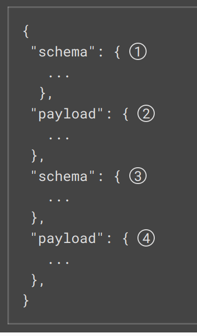

# Kiểm tra các connector plugin đã cài đặt
curl localhost:8083/connector-plugins | jq
curl -s localhost:8083/connector-plugins | jq '.[].class'

Debezium không hoạt động với mysql >8.4

curl -XPUT -H "Content-type: application/json" http://localhost:8083/connector-plugins/io.debezium.connector.mysql.MySqlConnector/config/validate --data 

curl -XPUT -H "Content-type: application/json" http://localhost:8083/connector-plugins/MySqlConnector/config/validate --data '{"connector.class": "io.debezium.connector.mysql.MySqlConnector", "tasks.max": "1","database.hostname": "db-app", "database.port": "3306", "database.user": "vohoang", "database.password": "12345678", "database.server.id": "112354", "database.include.list": "raw", "topic.prefix": "probation", "schema.history.internal.kafka.bootstrap.servers": "kafka-1:19091,kafka-2:19092,kafka-3:19093", "schema.history.internal.kafka.topic": "schema-changes.warehouse", "key.converter": "io.confluent.connect.avro.AvroConverter","value.converter": "io.confluent.connect.avro.AvroConverter","value.converter.schema.registry.url": "http://schema-registry-1:8081"}' |jq '.configs[]|select (.value.errors[]!=null) | .value'

curl -i -X POST -H "Accept:application/json" -H "Content-Type:application/json" localhost:8083/connectors/ -d @db-app-connector.json

# Cấu hình debezium
0. Kịch bản
```sh
version: '3'
services:
  zookeeper:
    image: confluentinc/cp-zookeeper:latest
    environment:
      ZOOKEEPER_CLIENT_PORT: 2181
      ZOOKEEPER_TICK_TIME: 2000

  kafka:
    image: confluentinc/cp-kafka:latest
    depends_on:
      - zookeeper
    environment:
      KAFKA_BROKER_ID: 1
      KAFKA_ZOOKEEPER_CONNECT: zookeeper:2181
      KAFKA_ADVERTISED_LISTENERS: PLAINTEXT://kafka:9092
      KAFKA_OFFSETS_TOPIC_REPLICATION_FACTOR: 1
    ports:
      - 9092:9092

  mysql:
    image: mysql:8.0
    environment:
      MYSQL_ROOT_PASSWORD: rootpassword
      MYSQL_USER: debeziumuser
      MYSQL_PASSWORD: dbz
      MYSQL_DATABASE: inventory
    ports:
      - 3306:3306
    command: --default-authentication-plugin=mysql_native_password --gtid-mode=ON --enforce-gtid-consistency=ON --binlog-format=ROW --log-bin=/var/lib/mysql/mysql-bin --server-id=223344

  debezium:
    image: debezium/connect:latest
    ports:
      - 8083:8083
    environment:
      BOOTSTRAP_SERVERS: kafka:9092
      GROUP_ID: 1
      CONFIG_STORAGE_TOPIC: debezium_connect_config
      OFFSET_STORAGE_TOPIC: debezium_connect_offsets
      STATUS_STORAGE_TOPIC: debezium_connect_status
      KEY_CONVERTER_SCHEMAS_ENABLE: false
      VALUE_CONVERTER_SCHEMAS_ENABLE: false
      VALUE_CONVERTER: org.apache.kafka.connect.json.JsonConverter
      KEY_CONVERTER: org.apache.kafka.connect.json.JsonConverter
    depends_on:
      - kafka
      - mysql
```
1. Capture toàn bộ dữ liệu
```sh
curl -i -X POST -H "Accept:application/json" \
  -H "Content-Type:application/json" http://localhost:8083/connectors/ \
  -d '{
    "name": "inventory-connector",
    "config": {
        "connector.class": "io.debezium.connector.mysql.MySqlConnector",
        "tasks.max": "1",
        "database.hostname": "mysql",
        "database.port": "3306",
        "database.user": "debeziumuser",
        "database.password": "dbz",
        "database.server.id": "223344",
        "database.server.name": "dbserver1",
        "database.whitelist": "inventory",
        "database.history.kafka.bootstrap.servers": "kafka:9092",
        "database.history.kafka.topic": "schema-changes.inventory"
    }
}'
```
2. Capture 1 số table. Có thêm trường table.whilelist
```sh
curl -i -X POST -H "Accept:application/json" \
  -H "Content-Type:application/json" http://localhost:8083/connectors/ \
  -d '{
    "name": "inventory-connector",
    "config": {
        "connector.class": "io.debezium.connector.mysql.MySqlConnector",
        "tasks.max": "1",
        "database.hostname": "mysql",
        "database.port": "3306",
        "database.user": "debeziumuser",
        "database.password": "dbz",
        "database.server.id": "223344",
        "database.server.name": "dbserver1",
        "database.whitelist": "inventory",
        "table.whitelist": "inventory.customers,inventory.orders",  # Chỉ capture bảng customers và orders
        "database.history.kafka.bootstrap.servers": "kafka:9092",
        "database.history.kafka.topic": "schema-changes.inventory"
    }
}'
```

# Debezium connector for mysql

Mỗi chữ connector dưới đây chỉ kafka connector thuộc dạng debezium cho mysql.

## 0. Introduce

Debezium có 1 binary log (binlog) log lại toàn bộ các thay đổi trong cơ sở dữ liệu được commit lên database như các thao tác insert, update, delete, thay đổi schema, ... và mysql dùng nó để nhân bản hay recovery nếu có lỗi xảy ra.
Debezium Mysql connector đọc binlog và produce change events ở các mức thấp hơn (INSERT, UPDATE, DELETE) và emit changes lên kafka topics.
Bằng cách này ta có thể việc CDC ít ảnh hưởng đến hiệu suất làm việc của mysql, để nó có thể chuyên tâm phục vụ các app.

Nguồn tài liêu: vào confluent hub -> Search Debezium mysql -> Tìm đến nơi chứa doc
https://debezium.io/documentation/reference/2.7/connectors/mysql.html#supported-mysql-topologies

Debezium còn hoạt động với nhiều source khác nhau như mariadb, mongodb, postgresql, oracle, sql server, db2, cassandra, ...

## 1. How the connector works

### 1.1. Supported MySQL topologies

Có rất nhiều kiểu deloy mysql và debezium hỗ trợ tất cả.

### 1.2. Schema history topic

Khi database client query database, client sẽ follow schema hiện tại của database. Tuy nhiên schema của database có thể thay đổi theo thời gian. Điều này đồng nghĩa connector phải có khả năng xác định schema của table mỗi khi CDC. Ngoài ra các consumer không thể apply schema hiện tại của connector để sử lý message cũ => Schema Registry trong Kafka confluent.

Trong binlog của mysql, không chỉ có mỗi row-change được ghi log mà còn có cả các câu lệnh DDL đã được table apply. Mỗi khi connector đọc đến đây, nó sẽ thực hiện điều chỉnh table schema trong cache của nó để apply cho các binlog tiếp theo.

Schema History Topic: ghi lại các câu lệnh DDL và vị trí của nó trong binlog.

Khi có sự cố xảy ra, connector phải stop và restart lại => Table schema trong cache không còn, connector sẽ đọc binlog tại vị trí bất kỳ (thường là vị trí cuối cùng mà nó capture). Connector dựa vào shcema history topic để tạo thành schema table dựa vào các câu lệnh DDL và vị trí cuả chúng sao cho khớp với vị trí hiện tại.

Hiển nhiên topic này chỉ nên dùng bởi connector.

When the MySQL connector captures changes in a table to which a schema change tool such as gh-ost or pt-online-schema-change is applied, there are helper tables created during the migration process. You must configure the connector to capture changes that occur in these helper tables. If consumers do not need the records the connector generates for helper tables, configure a single message transform (SMT) to remove these records from the messages that the connector emits.

<!-- Không có gì đảm bảo schema của table luôn không thay đổi theo thời gian. Điều này đồng nghiã với connector phải có khả năng xác định schema id và version tại mỗi thao tác insert/update/delete capture được. Các message trong topic của connector thu thập được không nhất thiết phải có schema giống nhau mà có thể thay đổi theo version. Binlog của mysql không chỉ có row-level changes mà còn log cả các DDL statements được database apply.

Để nó thể chắc chắn connector xử lý schema chính xác trước khi producer message trên kafka, mỗi khi gặp phải câu lệnh DDL trong binlog sẽ thực hiện phân tích câu lệnh và update lại schema vào cache. Connector sử dụng schema trong cache với mỗi thao tác CDC thu thập tiếp theo. Ngoài topic lưu trữ cần có 1 topic khác gọi là schema history topic để lưu lại các câu lệnh DDL và vị trí mà connector đã thu thập được trong binlog.

Mỗi khi có sự cố xảy ra, connector phải shutdown và restart lại và được yêu cầu đọc binlog lại từ 1 vị trí bất kỳ (không nhất thiết phải là cuối cùng) nó sẽ thực hiện rebuild lại schema của table tại thời điểm đó dựa vào topic schema history topic.

Schema history topic này chỉ cho phép connector sử dụng và connector có thể emit đó đến các consumer phục vụ cho tiêu thụ message.

When the MySQL connector captures changes in a table to which a schema change tool such as gh-ost or pt-online-schema-change is applied, there are helper tables created during the migration process. You must configure the connector to capture changes that occur in these helper tables. If consumers do not need the records the connector generates for helper tables, configure a single message transform (SMT) to remove these records from the messages that the connector emits. -->

### 1.3. Schema change topic

Hoàn toàn có thể config connector để nó produce schema change lên 1 topic khác, thường tên topic sẽ là <topic prefix>.prefix

Mỗi message sẽ có dạng như 

### 1.10. Topic name

Debezium Mysql Connector lưu các CDC như INSERT, UPDATE, DELETE vào 1 topic với mỗi table mà nó CDC trong DB.
Debezium sử dụng quy ước sau để đặt tên cho connector: **topicPrefix.databaseName.tableName**. Việc có thêm topicPrefix ở đầu có 1 số ích lợi, ví dụ ta muốn khai thác DB để phục vụ cho phân tích tài chính ta có thể đặt topicPrefix là 'finance' để phân biệt với các topic khác trong cluster. Ngoài ra DB đó có thể phục vụ cho team AI nên có thể đặt là 'ai' cho các topic CDC đó.

## 2. Data change events

Debezium mysql generate 1 data change events với mỗi row-level INSERT, UPDATE và DELETE và bắn lên kafka topic. Hiển nhiên phải có dạng K-V vì kafka chỉ lưu trữ cấu trúc dữ liệu dạng này.

Debezium và Kafka Connect thiết kế theo nguyên tắc truyền liên tục các thông điệp sự kiện (continuous streams of event messages). Tuy nhiên structure của message gửi đi sẽ thay đổi tùy thuộc vào cách table thay đổi (Đơn giản chỉ là CDC row-level, hơn thì là thay đổi schema của cá table). Để giải quyết vấn đè này, mỗi events sẽ phải chứa schema của riêng nó để độc lập với các message khác trong topic khác.

Thực tế ta có thể giảm nhẹ kích thước của message bằng cách chỉ cấu hình schema id. Schema Registry sẽ lưu schema chi tiết của event.

Mỗi event changes message sẽ có cấu trúc cơ bản là 4 phần như sau (hình sau là ở dạng JSON, còn các định dạng khác như Protobuf hay Avro tương tự). Tuy nhiên cấu trúc có thể thay đổi tùy thuộc vào cách bạn cấu hình Kafka connect converter đại diện cho 4 phần trên.



schema field chỉ ở trong change event message khi bạn cấu hình converter producer nó. Tương tự với event key và event payload trong change event chỉ khi bạn config producer nó. Trong hình trên, ta cấu hình JSON converter và config nó để produce 4 basic change event parts

1. Schema field đầu tiên là 1 phần của event key. Mô tả kafka connect schema (sẽ nằm trong schema registry nếu có thành phần này) của phần payload như khóa chính, ngoại, ...

2. Payload field đầu tiên cũng là 1 phần của event key. Chỉ chứa các key ở phần schema field đầu tiên mà các row đã thay đổi. **Tóm lại 2 cái đầu tiên dùng để mô tả schema của 1 table thay đổi**

3. Schema field thứ 2 là 1 phần của event value. Nó chỉ định schema mà trường payload kế tiếp sẽ sử dụng (tương tự như schema của event key).

4. Payload field thứ 2 là 1 phần của event value. Chứa dữ liệu thực tế khi row thay đổi.

### 2.1. Change event keys

1. Giải thích Change event keys.

  Khi có 1 sự thay đổi trong DB. Debezium sẽ captute event nó lại thành 1 message và gửi đi. Message phải có dạng K-V vì kafka chỉ lưu trữ dữ liệu dưới dạng Key-Value. Phần này nó về key của message.

  Chứa thông tin schema của khóa và giá trị khóa thực tế cho dòng dữ liệu thay đổi. Schema của khóa được định nghĩa dựa trên private key của table hoặc unique constrain tại thời điểm sự kiện được tạo.

2. Ví dụ về Customers table.

  ```sh
  CREATE TABLE customers (
    id INTEGER NOT NULL AUTO_INCREMENT PRIMARY KEY,
    first_name VARCHAR(255) NOT NULL,
    last_name VARCHAR(255) NOT NULL,
    email VARCHAR(255) NOT NULL UNIQUE KEY
  ) AUTO_INCREMENT=1001;
  ```

  Khóa chính của table là id => id được sử dụng làm key cho mọi change event

  Key của sự kiện: Mỗi sự kiện mà Debezium tạo ra khi có thay đổi trong bảng customers sẽ có một schema cho khóa giống nhau, miễn là định nghĩa bảng không thay đổi. Trong ví dụ này:

  ```sh
  {
  "schema": { 
      "type": "struct",
      # mysql-server-1 is the name of the connector that generated this event.
      # inventory is the database that contains the table that was changed.
      # customers is the table that was updated.
      "name": "mysql-server-1.inventory.customers.Key",
      "optional": false,
      "fields": [
        {
          "field": "id",
          "type": "int32",
          "optional": false
        }
      ]
    },
    "payload": { 
      "id": 1001
    }
  }
  ```

  schema: Mô tả cấu trúc của khóa. Ở đây, khóa là một đối tượng kiểu struct có tên là "mysql-server-1.inventory.customers.Key". Nó chứa một trường duy nhất là "id" có kiểu dữ liệu int32 và không phải là giá trị tùy chọn (optional: false).

  payload: Giá trị thực của khóa cho dòng đã thay đổi. Trong ví dụ này, id có giá trị là 1001.

### 2.1. Change event values
Phức tạp hơn so với khóa 1 chút và vẫn có 2 phần schema và payload. Có thể có các sự kiện như create event, update event, primary key updates delete events, tombstone events, truncate events.

## 3. Data type mappings

## 4. Custom converters

## 5. Setting up mysql

## 6. Deployment

## 7. Mornitoring

Debezium không hoạt động với mysql > 8.4
Debezium không capture những thay đổi trong quá khứ trước khi nó được tạo ra.
Debezium không thể lưu schema id và version được trong header.

# Kỹ thuật debezium outbox
0. Vấn đề
- Bạn muốn capture 1 table ? Hay bạn muốn capture 2-3 table hay thậm chí cả database.
- Theo mặc định khi dùng debezium, mỗi table sẽ được generate ra 1 topic theo chiến lược đặt tên mặc định của schema registry. Với Nosql thì không có vấn đề gì xảy ra debezium bình thường. Nhưng khi bạn đối phó với RDBMS sẽ là chuyển khác.
- Điều gì sẽ xảy ra nếu table của bạn có khóa chính và ngoại. Nếu phân mảnh thành các topic thì điều gì đảm bảo rằng các topic luôn đồng bộ. Có thể thực thể khóa ngoại được public lên trước trong khi thực thể khóa chính còn chưa được up lên topic. Rồi thì consumer tiêu thụ thực thể khóa ngoại chậm hơn consumer tiêu thụ khóa chính thậm chí là chết. Lúc này khi từ thực thể khóa ngoại muốn truy vấn đên thông tin thực thể khóa chính thì khóc thét.
1. Giải pháp 1:
  Sử dụng chiến lược đẩy hết các dữ liệu CDC được về cùng 1 topic duy nhất. Trong topic này các message có thể đến từ nhiều table khác nhau và schema chắc chắn phải là độc lập với mỗi topic => Phải dùng định dạng protobuf/avro và kết hợp với schema registry. 
  Nhược điểm chính của giải pháp này là không thể chia partition, vì qúa trình CDC cần phải được xử lý đồng bộ, nếu chia partition thì các consumer có thể xung đột với nhau => Mất khả năng xử lý phân tán của kafka.
2. Giải pháp 2: 
  outbox. Tại source, thay vì ngay lập tức đẩy các thay đổi từ các table nên các topic. Ta sẽ insert nó vào 1 table mới tên là outbox với schema ta tự định nghĩa chứa toàn bộ thông tin khóa chính, ngoại thực thể liên kết, ... **Sau đó chỉ việc dùng debezium CDC đến 1 table duy nhất và cách này giải quyết được vấn đề đồng bộ, sự kiện nào xảy ra trước.**. Cấu trúc của outbox thường như sau
  ```sh
  # id: Mã định danh duy nhất của sự kiện.
  # aggregate_type: Loại bảng hay đối tượng liên quan (ví dụ: accounts, sales_pipelines).
  # aggregate_id: Khóa chính của bảng liên quan.
  # payload: Nội dung của sự kiện (dữ liệu thay đổi).
  # timestamp: Thời gian xảy ra sự kiện, giúp xác định thứ tự.
  CREATE TABLE outbox (
      id BIGINT AUTO_INCREMENT PRIMARY KEY,
      aggregate_type VARCHAR(255) NOT NULL,
      aggregate_id VARCHAR(255) NOT NULL,
      event_type VARCHAR(255) NOT NULL,
      payload JSON NOT NULL,
      timestamp TIMESTAMP DEFAULT CURRENT_TIMESTAMP
  );
  ```
  Tùy từng nghiệp vụ payload có thể thay đổi theo ý muốn. Ví dụ ta chỉ muốn theo dõi sale_pipelines table. Tuy nhiên nó lại liên kết khóa ngoại với nhiều table khác như accounts, ... => Tạo triggle trên table outbox luôn mỗi khi có sự kiện trên table sale_pipelines xảy ra.
  Điểm yếu phương pháp: bên phía source thêm gánh nặng phải tạo record trên table outbox và làm giảm hiệu suất. Ngoài ra vẫn không tận dùng được tính phân tán partition trong kafka.
3. Giải pháp 3:
  Tắt chế độ PK-FK ở sink đi, đảm bảo các message ở các topic sẽ được xử lý ngay lập tức => Không đảm bảo được tính đồng bộ nhưng tận dụng được khả năng tiêu thụ phân tán của kafka thậm trí dùng JDBC sink connector thay vì consumer luôn (JDBC sink connector chỉ đảm bảo xử lý 1 table 1 thời điểm)
4. Giải pháp 4: hay nhất
  Phát triển từ giải pháp 2, nó ngu người ở chỗ tạo table mới và triggle trên source. Điều này sẽ làm db source thêm việc và nếu dữ là dữ liệu stream thì độ vất chắc chắn lớn. Mà db source thường lại là db của 1 app production phục vụ end users.